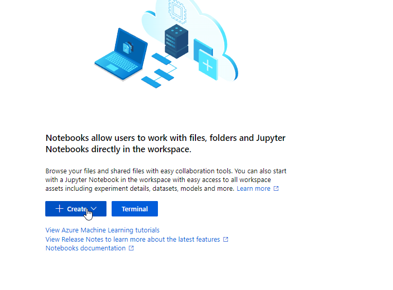

# Practice Azure Age Detection

----------------------------------------------------------------
##### -To perform this practice, please do the following repository
[Azure ML Auto GitHub](https://github.com/chivaa97/practice-azure-ml-auto)

--------
##### -Click on notebooks.

##### -Create a new notebook and then create a new file.

##### -Set a name choose notebook type and click on create.
## -Is import respect the extension.

##### -Follow the next [link](https://raw.githubusercontent.com/josejesusguzman/face-api-consumption-python/main/face-consumption.py).
#### -Click on raw, ctrl + a and ctrl + c to copy the code.

##### -Paste the code in hte notebook.

##### -Copy some image URL and paste.

##### -Go to portal.azure.com and search "Face API", click on create.

##### -Select a resource group created, or you can create a new resource group.
##### -Set a name, a choose a pricing tier then click on create.

##### -Go to resource.

##### -Go to key and endpoints.
##### -Copy the first line.

##### -Paste.

##### -Copy the endpoint.

##### -Paste.

##### -Click here to run the code.

##### -Scroll down, and we can see the result.

## 🔥🔥Congratulations...! you made an age detector🔥🔥
